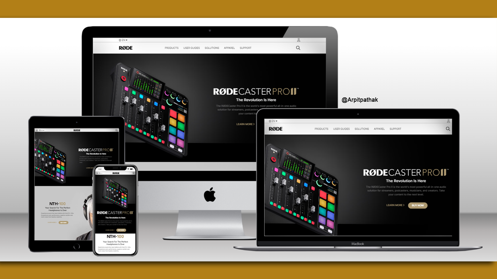

# RODE.com Website

## Rode.com clone 🚀 Website's [Live Link](https://rodecom.netlify.app/)🔗

>by Arpit Pathak ✨

Website on different devices

Screenshot

## 📌 What I learned from this Project? 📝

- The project is made entirely with html and tailwind css, so I have learned about tailwind in-depth.
- Learned to create Semi-transparent color layer over background-image on hover on card.
- Learned to use position `Relative` & `Absolute` with `z-index` in combination so that items can be stacked on top of each other.
- I learned how to make beautiful cards with hover effect 
- Learned about `Flexbox` and its properties `justify-content`, `align-items`, `gap` & `flex-direction`.

## 📌 Time taken to finish this project ⏳
- 6.5 hours

---

